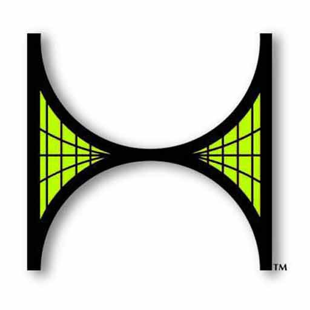

  

    
  

# The OMAR Programming Language

The OMAR programming language is a high level, general purpose language that prioritizes readability and ease of use.  It uses a static typing system and built in array and data structure capabilities which enable high performance.  

# Documentation

For details about how to use the OMAR programming language, see the [OMAR Programming Language Reference Manual](docs/The OMAR Programming Language.pdf).

# History

The OMAR programming language was originally developed for the Hypercosm 3D graphics and simulation system and was used between 1999 and 2012 as part of the Hypercosm simulation system. 

<!-- LICENSE -->

# License

Distributed under the MIT license which allows urestricted use of the software. See [LICENSE.txt](LICENSE.txt) for more information.

<!-- CONTACT -->

# Contact

Abe Megahed - (mailto:amegahed@wisc.edu) - email
